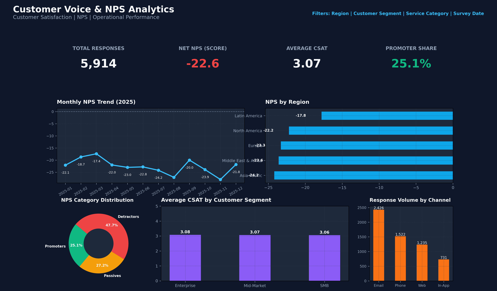
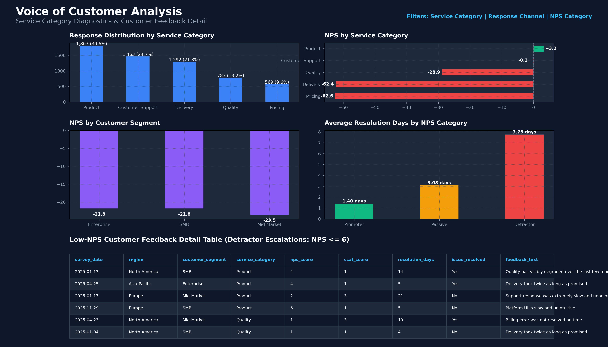

# Customer Voice & NPS Analytics Dashboard

An end-to-end customer experience analytics project analyzing synthetic customer survey responses. The pipeline covers automated data cleaning, relational SQL modeling, REST API data serving, Power Query transformations, Power BI data modeling, DAX measures, and interactive reporting.

> **Dataset Disclosure:** The dataset used in this project is synthetic and was created for educational and portfolio purposes.

---

## Key Results

| Metric | Value |
| :--- | :--- |
| **Raw Responses** | 6,000 |
| **Cleaned Responses** | 5,914 |
| **Net NPS** | -22.6 points |
| **Promoter %** | 25.11% (1,485 responses) |
| **Passive %** | 27.19% (1,608 responses) |
| **Detractor %** | 47.70% (2,821 responses) |
| **Average CSAT** | 3.07 / 5.0 |
| **Average Resolution Time** | 4.89 days |
| **Detractor Resolution Time** | 7.75 days |
| **Promoter Resolution Time** | 1.40 days |

---

## Tech Stack

- **Data Processing & Validation:** Python, Pandas, Matplotlib, Seaborn
- **Database & Querying:** SQLite, SQL
- **API Service:** FastAPI, Uvicorn
- **Business Intelligence:** Power Query (M), Power BI, DAX

---

## Pipeline

`Synthetic Data` → `Python / Pandas` → `Data Cleaning` → `SQLite / SQL` → `FastAPI` → `Power Query` → `Power BI / DAX` → `Dashboard`

---

## Dashboard

The report features two pages:
1. **Customer Experience Overview:** Executive monitoring of Net NPS, CSAT, monthly trends, regional performance, customer segments, and response channels.
2. **Voice of Customer Analysis:** Diagnostic breakdown of service categories, NPS segmentation, operational resolution times, and detractor feedback.





> **Development Notice:** The repository contains machine-readable Power BI Project (`.pbip`) artifacts and dashboard preview renders. Power BI Desktop was not available in the development environment for GUI execution or testing.

---

## Data Quality

```
6,000 raw records - 35 duplicate records - 51 invalid records = 5,914 cleaned records
```

Missing values in metadata and inconsistent text casing were repaired during preprocessing. For the complete audit trail, see [Data Quality Documentation](docs/data-quality.md).

---

## Business Insights

- **Operational Resolution Delay:** Detractors required substantially longer resolution times than promoters (7.75 vs 1.40 days).
- **Category Friction:** Pricing and Delivery recorded strongly negative Net NPS scores compared to Product and Customer Support.
- **Segment & Regional Variance:** Customer satisfaction scores varied across account segments (Enterprise vs SMB) and global regions.

For the detailed analysis, see [Business Insights Documentation](docs/business-insights.md).

---

## Repository Structure

- **`data/`** — Raw and cleaned datasets + SQLite database (`customer_voice.db`)
- **`python/`** — Data generation, profiling, cleaning, EDA, and validation scripts
- **`sql/`** — Relational schema and 14 analytical SQL queries
- **`api/`** — FastAPI REST microservice (`GET /api/health`, `GET /api/feedback`)
- **`powerbi/`** — Power BI Project (`.pbip`), data model, and report definitions
- **`docs/`** — Detailed technical documentation
- **`screenshots/`** — Dashboard preview renders and EDA charts

---

## Quick Start

### 1. Environment Setup
```bash
git clone <repository-url>
cd customer-voice-nps-dashboard
python -m venv .venv
# Activate environment (Windows: .venv\Scripts\activate | Unix: source .venv/bin/activate)
pip install -r requirements.txt
```

### 2. Run Pipeline & API
```bash
python python/data_cleaning.py
python python/setup_sqlite.py
uvicorn api.main:app --host 127.0.0.1 --port 8000
```
- Interactive API documentation is available at `http://127.0.0.1:8000/docs`.

### 3. Power BI
- Open `powerbi/Customer_Voice_Analytics.pbip` using Power BI Desktop to load the dataset, Star Schema model, and report layout.

---

## Documentation

- [Data Quality Audit](docs/data-quality.md)
- [Data Dictionary](docs/data-dictionary.md)
- [Data Model](docs/data-model.md)
- [Power Query Specifications](docs/power-query.md)
- [DAX Measures Reference](docs/dax-measures.md)
- [Dashboard Design Specifications](docs/dashboard_design.md)
- [Business Insights Report](docs/business-insights.md)
- [System Architecture](docs/architecture.md)
- [Interview Q&A Guide](docs/interview-notes.md)

---

## Limitations

- Dataset is synthetic and created for educational/portfolio purposes.
- FastAPI server currently runs locally (`http://127.0.0.1:8000`).
- Power BI Desktop GUI testing was not available in the development environment; Power BI Project (`.pbip`) artifacts and dashboard preview renders are included.
