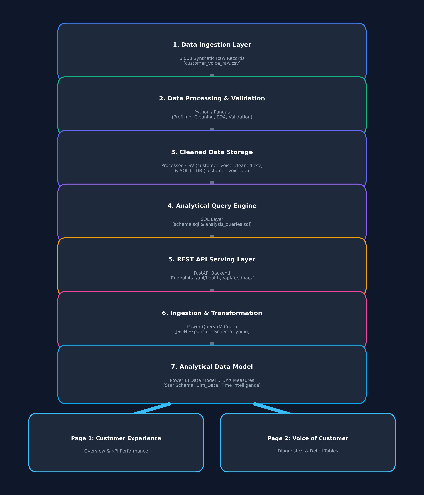

# Customer Voice & NPS Analytics Dashboard

> **End-to-End Data Analyst Portfolio Project**  
> *Built with Python, Pandas, SQLite, SQL, FastAPI, Power Query, Power BI, and DAX.*

---

## Overview
This project presents an end-to-end customer experience (CX) and operational performance analytics solution. It models a realistic enterprise customer survey ecosystem of **6,000 raw feedback records** across 12 months, implementing a complete data engineering and business intelligence pipeline:

`Synthetic Data Generation -> Data Profiling -> Pandas Data Cleaning -> SQLite Storage -> Analytical SQL -> FastAPI REST Microservice -> Power Query M Transformations -> Power BI Star-Schema Modeling -> DAX Calculations -> Interactive Dashboards & Business Insights`.

---

## Business Problem
Modern enterprises struggle to connect qualitative customer feedback (NPS, CSAT, feedback text) with operational service performance metrics (issue resolution time, support channels, service categories). Without a unified analytics pipeline:
1. Executive leadership lacks real-time visibility into overall Net Promoter Score (NPS) trends.
2. Operational teams cannot quantify how support delays impact customer dissatisfaction.
3. Product and service managers lack diagnostic detail on which service categories generate negative NPS ratings.

---

## Objectives
- **Build a production-grade data pipeline** processing survey responses from raw ingestion to BI visualization.
- **Profile and validate raw data quality** by detecting duplicates, missing values, non-standard text casing, and out-of-bounds metrics.
- **Develop an analytical database and SQL layer** executing 14 business-focused analytical queries in SQLite.
- **Expose cleaned data via REST API** using FastAPI to deliver dynamic JSON data streams to Power BI / Power Query.
- **Create an executive Power BI dashboard** featuring 2 dedicated report pages (*Customer Experience Overview* and *Voice of Customer Analysis*).
- **Extract defensible business insights** identifying operational bottlenecks and strategic revenue protection actions.

---

## Dataset

### Synthetic Dataset Disclosure
> [!IMPORTANT]
> **The dataset used in this project is synthetic and was created explicitly for educational and portfolio purposes.** It simulates realistic customer survey responses and operational relationships but does not represent real customer or corporate data from any existing business entity.

### Dataset Size
- **Raw Dataset (`data/raw/customer_voice_raw.csv`):** EXACTLY **6,000 raw records**, 13 columns.
- **Cleaned Dataset (`data/processed/customer_voice_cleaned.csv`):** **5,914 cleaned records**, 13 columns.

---

## Dataset Schema

The dataset contains 13 core attributes:

| # | Column Name | Data Type | Meaning / Description | Example |
| :--- | :--- | :--- | :--- | :--- |
| 1 | `response_id` | `TEXT` | Unique identifier for each survey response | `RSP-0001` |
| 2 | `customer_id` | `TEXT` | Customer account identifier (supports multiple responses) | `CUST-1042` |
| 3 | `survey_date` | `DATE` | Date survey response was recorded | `2025-06-15` |
| 4 | `region` | `TEXT` | Geographical region (`North America`, `Europe`, `Asia-Pacific`, etc.) | `North America` |
| 5 | `customer_segment` | `TEXT` | Account commercial segment (`Enterprise`, `Mid-Market`, `SMB`) | `Enterprise` |
| 6 | `industry` | `TEXT` | Customer industry sector (`Technology`, `Healthcare`, `Finance`, etc.) | `Technology` |
| 7 | `response_channel` | `TEXT` | Survey submission touchpoint (`Email`, `Phone`, `Web`, `In-App`) | `Email` |
| 8 | `service_category` | `TEXT` | Service category (`Product`, `Delivery`, `Customer Support`, etc.) | `Customer Support` |
| 9 | `nps_score` | `INTEGER` | Net Promoter Score rating (scale 0–10) | `9` |
| 10 | `csat_score` | `INTEGER` | Customer Satisfaction rating (scale 1–5) | `4` |
| 11 | `resolution_days` | `INTEGER` | Days taken to resolve support issue | `3` |
| 12 | `issue_resolved` | `TEXT` | Support ticket resolution status (`Yes`, `No`) | `Yes` |
| 13 | `feedback_text` | `TEXT` | Verbatim text feedback submitted by customer | `"Fast support response."` |

---

## Data Quality & Cleaning Reconciliation

Data cleaning was executed programmatically via `python/data_cleaning.py`. The cleaning audit is mathematically reconciled as follows:

```
  6,000  Raw Survey Records
-    35  Exact Duplicate Response IDs Removed
-    51  Invalid / Out-of-Bounds Records Removed (15 NPS, 12 CSAT, 14 Resolution, 10 Date)
--------------------------------------------------
= 5,914  Final Verified Cleaned Records
```

- **Repaired Records (197 Rows):** 59 missing industries -> `"Unknown"`, 59 missing feedback -> `"No feedback provided"`, 90 missing CSAT -> median score (`4`), 79 categories -> Title Case.

*Detailed documentation: [`docs/data-quality.md`](docs/data-quality.md)*

---

## Exploratory Data Analysis

Exploratory Data Analysis was performed using Pandas, Seaborn, and Matplotlib (`python/eda.py`). 9 analytical charts were generated and saved in `screenshots/eda/`:
- NPS Score & CSAT Rating Distributions
- Net NPS by Region, Customer Segment, and Service Category
- Monthly Response Volume Trend (2025)
- Channel Response Distribution & Resolution SLA by NPS Category

---

## SQL Analysis

Cleaned data was loaded into an analytical SQLite database (`data/customer_voice.db`). 14 analytical SQL queries were engineered and validated in `sql/analysis_queries.sql`:
- Total Responses, Average NPS, Average CSAT
- Promoter, Passive, and Detractor Counts
- Net NPS Score via SQL `CASE` statements
- Grouped aggregation by Region, Segment, Category, and Channel
- Average Resolution Days by NPS category

---

## REST API

A lightweight microservice REST API was built using **FastAPI** (`api/main.py`) to serve SQLite data to downstream BI tools:
- **`GET /api/health`**: Returns operational status, SQLite connection details, and total record count (`5,914`).
- **`GET /api/feedback`**: Exposes cleaned customer records as a JSON payload with optional filtering parameters (`skip`, `limit`, `region`, `customer_segment`).
- **Interactive Swagger UI Documentation:** Accessible at `http://127.0.0.1:8000/docs`.

---

## Power Query

Power Query ingests JSON data directly from the REST API endpoint (`http://127.0.0.1:8000/api/feedback`):
1. Expands JSON record objects into a structured 13-column tabular format.
2. Enforces explicit schema types (`Date`, `Int64`, `Text`).
3. Adds a custom M calculated column `nps_category` (`Promoter`, `Passive`, `Detractor`).
4. Standardizes category text casing.

*Power Query M Code: [`docs/power-query.md`](docs/power-query.md)*

---

## Power BI Data Model & Project Artifacts

The Power BI report utilizes a **Single-Fact Star Schema**:
- **Fact Table:** `feedback` (5,914 records)
- **Dimension Table:** `Dim_Date` (DAX calculated calendar table)
- **Relationship:** `Dim_Date[Date] 1:* feedback[survey_date]` (Single direction filter)
- **Power BI Project Files:** Complete machine-readable `.pbip` project generated in `powerbi/Customer_Voice_Analytics.pbip`.

*Data Model Documentation: [`docs/data-model.md`](docs/data-model.md)*

---

## DAX Measures

9 core DAX measures were implemented and reconciled against SQL and Python outputs:
- **`Total Responses`** = `COUNTROWS(feedback)` (`5,914`)
- **`Promoters`** = `CALCULATE(COUNTROWS(feedback), feedback[nps_score] >= 9)` (`1,485`)
- **`Passives`** = `CALCULATE(COUNTROWS(feedback), feedback[nps_score] = 7 || feedback[nps_score] = 8)` (`1,608`)
- **`Detractors`** = `CALCULATE(COUNTROWS(feedback), feedback[nps_score] <= 6)` (`2,821`)
- **`Promoter %`** = `DIVIDE([Promoters], [Total Responses], 0)` (`25.11%`)
- **`Detractor %`** = `DIVIDE([Detractors], [Total Responses], 0)` (`47.70%`)
- **`NPS`** = `([Promoter %] - [Detractor %]) * 100` (`-22.59` / `-22.6` points)
- **`Average CSAT`** = `AVERAGE(feedback[csat_score])` (`3.07`)
- **`Average Resolution Days`** = `AVERAGE(feedback[resolution_days])` (`4.89 days`)

*DAX Formulas: [`docs/dax-measures.md`](docs/dax-measures.md)*

---

## Dashboard Pages

### Page 1: Customer Experience Overview
- **Header:** Executive title banner and global slicers (Region, Segment, Service Category, Survey Date).
- **KPI Cards:** Total Responses (`5,914`), Net NPS (`-22.6`), Average CSAT (`3.07`), Promoter Share (`25.1%`).
- **Visuals:** Monthly NPS Trend (Line Chart), NPS by Region (Horizontal Bar Chart), NPS Category Distribution (Donut Chart - Promoters vs Passives vs Detractors), Average CSAT by Customer Segment (Bar Chart), Response Volume by Channel (Bar Chart).

### Page 2: Voice of Customer Analysis
- **Header:** Diagnostic title banner and category slicers.
- **Visuals:** Response Distribution by Service Category, NPS by Service Category, NPS by Segment, Average Resolution Days by NPS Category.
- **Detail Tables:** Low-NPS Customer Feedback Detail Table (`nps_score <= 6`).

---

## Business Insights

1. **Operational Resolution Latency Strongly Associated with Detractors:** Detractors averaged **7.75 resolution days**, compared to **1.40 days** for Promoters (5.5x difference).
2. **Pricing and Delivery Drive Heavy Dissatisfaction:** Pricing recorded Net NPS of **-62.6** and Delivery **-62.4**, compared to Customer Support (**-0.3**) and Product (**+3.2**).
3. **Mid-Market Segment Lags in Satisfaction:** Mid-Market accounts recorded Net NPS of **-23.5** (CSAT 3.07), compared to Enterprise (**-21.8**) and SMB (**-21.9**).
4. **Regional Variance:** Asia-Pacific (**-24.3 NPS**) and Middle East & Africa (**-23.6 NPS**) lag behind North America (**-22.2 NPS**) and Latin America (**-17.8 NPS**).

*Detailed Insights: [`docs/business-insights.md`](docs/business-insights.md)*

---

## Architecture



```
6,000 Synthetic Customer Feedback Records
                    ↓
             Python / Pandas
                    ↓
        Data Profiling + EDA
                    ↓
       Data Cleaning + Validation
                    ↓
                 SQLite
                    ↓
                   SQL
                    ↓
                FastAPI
                    ↓
                  JSON
                    ↓
              Power Query
                    ↓
             Power BI Model
                    ↓
                  DAX
                    ↓
        ┌───────────┴───────────┐
        ↓                       ↓
Customer Experience      Voice of Customer
     Dashboard                Dashboard
```

---

## Screenshots

- **Page 1: Customer Experience Overview:** `screenshots/customer_experience_overview.png`
- **Page 2: Voice of Customer Analysis:** `screenshots/voice_of_customer.png`
- **FastAPI Interactive Swagger UI:** `screenshots/api_swagger.png`
- **Exploratory Data Analysis Charts:** `screenshots/eda/*.png`

---

## Project Structure

```
customer-voice-nps-dashboard/
│
├── data/
│   ├── raw/customer_voice_raw.csv       # 6,000 synthetic raw survey records
│   ├── processed/customer_voice_cleaned.csv # 5,914 cleaned records
│   └── customer_voice.db                # SQLite relational database
│
├── python/
│   ├── generate_raw_data.py             # Synthetic raw data generator
│   ├── data_profiling.py                # Automated data profiling script
│   ├── data_cleaning.py                 # Data validation & cleaning pipeline
│   ├── eda.py                           # Exploratory data analysis & chart generator
│   ├── setup_sqlite.py                  # SQLite database setup & query runner
│   ├── render_dashboards.py             # Dashboard preview renderer
│   ├── create_pbip_project.py           # Power BI Project (.pbip) artifact generator
│   ├── generate_architecture_diagram.py # Architecture diagram generator
│   └── validate_project.py              # Automated test validation runner
│
├── api/
│   ├── main.py                          # FastAPI REST application endpoints
│   ├── database.py                      # SQLite database interface layer
│   └── requirements.txt                 # API dependencies
│
├── sql/
│   ├── schema.sql                       # SQLite database table schema & indexes
│   └── analysis_queries.sql             # 14 analytical SQL queries
│
├── powerbi/
│   ├── Customer_Voice_Analytics.pbip    # Power BI Project file
│   ├── Customer_Voice_Analytics.Report/ # Report definition & layout
│   └── Customer_Voice_Analytics.Dataset/# Dataset model, M code & DAX measures
│
├── docs/
│   ├── dataset-profile.md               # Calculated profiling metrics
│   ├── data-dictionary.md               # 13-column schema data dictionary
│   ├── data-quality-seed.md             # Documented intentional raw anomalies
│   ├── data-quality.md                  # Raw vs cleaned data quality audit
│   ├── power-query.md                   # Power Query M code reference
│   ├── data-model.md                    # Power BI data model & Star Schema
│   ├── dax-measures.md                  # DAX measures dictionary & validation
│   ├── business-insights.md             # Derived business findings & recommendations
│   ├── architecture.md                  # System architecture documentation
│   ├── architecture.png                 # Architecture diagram image
│   └── interview-notes.md               # Comprehensive interview Q&A guide
│
├── screenshots/
│   ├── customer_experience_overview.png # Page 1 Dashboard preview
│   ├── voice_of_customer.png            # Page 2 Dashboard preview
│   ├── api_swagger.png                  # FastAPI Swagger UI documentation
│   └── eda/                             # 9 EDA charts
│
├── README.md                            # Comprehensive project README
├── .gitignore                           # Git ignore rules
└── requirements.txt                     # Global Python requirements
```

---

## How to Run

### 1. Clone & Set Up Environment
```bash
cd customer-voice-nps-dashboard
python -m venv .venv
# Activate Virtual Environment:
# Windows: .venv\Scripts\activate
pip install -r requirements.txt
```

### 2. Generate Raw Data, Profile, and Clean
```bash
python python/generate_raw_data.py
python python/data_profiling.py
python python/data_cleaning.py
python python/eda.py
```

### 3. Initialize SQLite Database & Run SQL Queries
```bash
python python/setup_sqlite.py
```

### 4. Launch FastAPI REST API Server
```bash
uvicorn api.main:app --host 127.0.0.1 --port 8000 --reload
```
- Test health check: `http://127.0.0.1:8000/api/health`
- Test JSON feedback stream: `http://127.0.0.1:8000/api/feedback`
- Interactive API Docs: `http://127.0.0.1:8000/docs`

### 5. Open Power BI Report
- Open Power BI Desktop and double-click `powerbi/Customer_Voice_Analytics.pbip` to open the report project automatically.

---

## Limitations
1. **Synthetic Data Nature:** The dataset is generated synthetically to emulate business survey patterns and does not incorporate real-world exogenous macro factors (e.g. seasonal market shifts).
2. **Local API Hosting:** FastAPI runs on localhost (`http://127.0.0.1:8000`). Production deployment requires cloud hosting (e.g. AWS Lambda / Azure App Service).
3. **Single-Node SQLite:** SQLite is optimized for analytical reads in single-user setups; enterprise production scale would benefit from PostgreSQL or Snowflake.
4. **Environment GUI Automation:** Power BI Desktop GUI execution is not automated directly on headless system servers; full Power BI Project (`.pbip`) artifacts are generated for instant Desktop loading.

---

## Future Improvements
- **Automated Airflow Pipeline:** Orchestrate Python cleaning, SQLite loading, and API container deployment using Apache Airflow.
- **Docker Containerization:** Package FastAPI application into a Docker container for cloud deployment.
- **Power BI Gateway Integration:** Configure Power BI Service scheduled refresh via On-Premises Data Gateway connecting to FastAPI endpoints.
